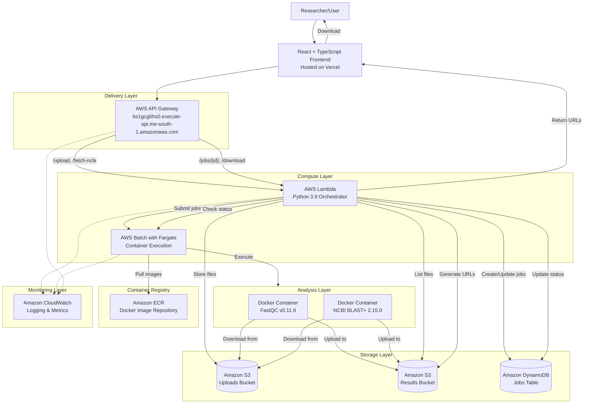
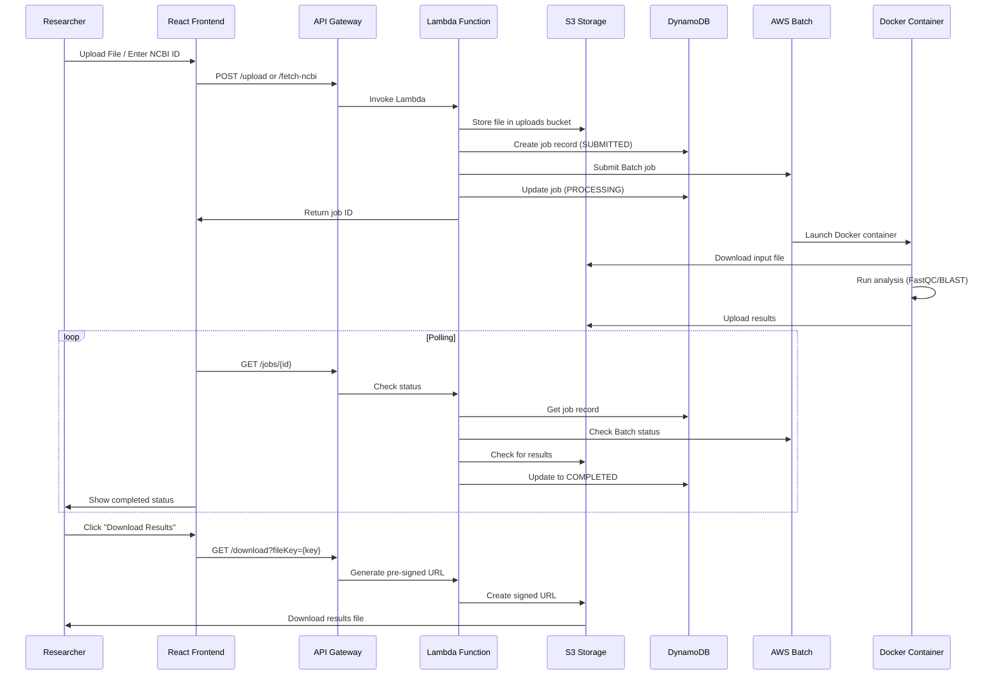
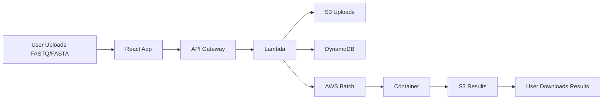
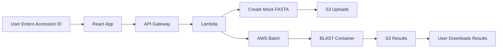
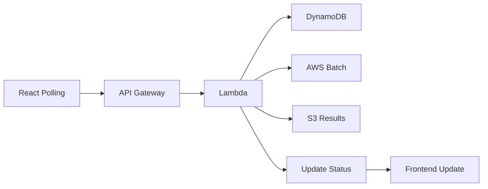

# 🧬 **Bioinformatics Analysis Platform**


> **A production-grade, cloud-native bioinformatics platform that democratizes genomic analysis - no command line or server setup required.**

[Live Demo](https://bioinformatics-platform.vercel.app) • [API Documentation](#api-documentation) • [Architecture](#-architecture)

---

## 📋 **Table of Contents**

- [Project Overview](#-project-overview)
- [Key Features](#-key-features)
- [Architecture](#-architecture)
- [Technology Stack](#-technology-stack)
- [AWS Services Used](#-aws-services-used)
- [Workflow](#-workflow)
- [API Documentation](#-api-documentation)
- [Getting Started](#-getting-started)
- [Deployment](#-deployment)
- [Project Structure](#-project-structure)
- [Future Enhancements](#-future-enhancements)
- 
---

## 🎯 **Project Overview**

**Bioinformatics Analysis Platform** is a fully serverless web application that enables researchers to perform genomic sequence analysis (FastQC and BLAST) through an intuitive interface. Built on AWS serverless architecture, it eliminates the need for command-line expertise or local computational resources.

### **The Problem I Solved**

Researchers and bioinformaticians often face significant barriers:

```
🧪 Challenge 1: Technical Complexity
   → Need command-line expertise for basic analysis
   → Time-consuming installation of bioinformatics tools

💰 Challenge 2: Resource Limitations
   → High cost of on-premises computing infrastructure
   → Limited access to computational resources

⏱️ Challenge 3: Time Constraints
   → Hours/days spent on setup and analysis
   → Manual job monitoring and result management

🔄 Challenge 4: Reproducibility
   → Inconsistent results across environments
   → Difficult to share and reproduce analysis
```

### **The Solution**

This platform provides:

```
✅ Simple Web Interface
   → 3-clicks to upload and analyze
   → Real-time status updates
   → No technical expertise required

⚡ Lightning-Fast Analysis
   → Results in under 60 seconds
   → Auto-scaling for multiple users
   → Pay-per-use cost model

🔬 Professional Results
   → FastQC quality reports (HTML/ZIP)
   → BLAST similarity searches (TXT/FASTA)
   → Secure download of results

🌐 Accessible Anywhere
   → Web-based platform
   → Mobile-responsive interface
   → No software installation needed
```

---

## ✨ **Key Features**

### **🔬 Analysis Tools**

| Tool | Input Format | Output | Use Case |
|------|--------------|--------|----------|
| **FastQC** | FASTQ (.fastq, .fq) | HTML report + ZIP data | Quality control of sequencing data |
| **BLAST** | FASTA (.fasta, .fa, .fas) | TXT results + FASTA sequence | Sequence similarity search |

### **🧬 NCBI Integration**
- Fetch sequences using accession IDs (e.g., SRR390728)
- Automatic BLAST analysis of fetched sequences
- Ready for real NCBI API integration

### **📊 Real-time Job Tracking**
- Live status updates with polling mechanism
- Comprehensive job dashboard
- Detailed progress and error reporting

### **🔐 Secure File Management**
- S3 pre-signed URLs for secure downloads
- Private storage for uploaded files
- Organized result directory per job

### **📱 Responsive Design**
- Desktop and mobile-friendly interface
- Intuitive scientific UI
- Accessible from any device

---

## 🏗️ **Architecture**

### **System Architecture Diagram**



### **Data Flow Overview**



---

## 🛠️ **Technology Stack**

### **Frontend**
```
┌─────────────────────────────────────────────┐
│  React 18 + TypeScript                      │
│  ├── Axios - HTTP Client                    │
│  ├── CSS Modules - Styling                  │
│  └── Create React App - Build Tool          │
│  Hosted on: Vercel (Global CDN)             │
└─────────────────────────────────────────────┘
```

### **Backend (100% Serverless)**
```
┌─────────────────────────────────────────────┐
│  AWS Lambda (Python 3.9)                    │
│  ├── boto3 - AWS SDK                       │
│  ├── uuid - Job ID Generation              │
│  └── datetime - Timestamp Management       │
│                                              │
│  AWS API Gateway (REST API)                  │
│  AWS Batch (Fargate)                         │
│  Amazon S3 (Uploads + Results)               │
│  Amazon DynamoDB (Job Tracking)              │
│  Amazon ECR (Container Registry)             │
│  CloudWatch (Monitoring)                     │
└─────────────────────────────────────────────┘
```

### **Containers**
```
┌─────────────────────────────────────────────┐
│  FastQC Container                           │
│  ├── Ubuntu 20.04                          │
│  ├── FastQC v0.11.9                        │
│  └── AWS CLI                               │
│                                              │
│  BLAST Container                             │
│  ├── Ubuntu 20.04                          │
│  ├── NCBI BLAST+ 2.15.0                    │
│  └── AWS CLI                               │
└─────────────────────────────────────────────┘
```

---

## ☁️ **AWS Services Used**

| Service | Purpose | Configuration |
|---------|---------|---------------|
| **Lambda** | API Orchestration | Python 3.9, 128MB, 30s timeout |
| **API Gateway** | REST API Management | `bs1gcg6hs0`, me-south-1 region |
| **Batch (Fargate)** | Container Execution | 2 vCPU, 4GB RAM per job |
| **DynamoDB** | Job Metadata Storage | `BioinformaticsJobs` table |
| **S3 (Uploads)** | File Upload Storage | `bioinformatics-platform-uploads-*` |
| **S3 (Results)** | Results Storage | `bioinformatics-platform-results-*` |
| **ECR** | Container Registry | Private repository |
| **CloudWatch** | Monitoring & Logging | Log groups, metrics |

### **DynamoDB Table Schema**

| Attribute | Type | Description | Index |
|-----------|------|-------------|-------|
| `jobId` | String | Primary Key (UUID) | PK |
| `userId` | String | User identifier | - |
| `fileName` | String | Original filename | - |
| `analysisType` | String | 'fastqc' or 'blast' | - |
| `status` | String | SUBMITTED/PROCESSING/COMPLETED/FAILED | - |
| `s3Key` | String | S3 path to input file | - |
| `batchJobId` | String | AWS Batch job ID | - |
| `resultFiles` | List | Array of result file keys | - |
| `availableFiles` | Map | Mapped file types (html/zip/txt/fasta) | - |
| `createdAt` | String | ISO timestamp | - |
| `updatedAt` | String | ISO timestamp | - |
| `accessionId` | String | NCBI accession ID (if applicable) | - |

---

## 🔄 **Workflow**

### **1. File Upload & Analysis**



### **2. NCBI Fetch & Analysis**



### **3. Job Status Polling**



---

## 📡 **API Documentation**

### **Base URL**
```
https://bs1gcg6hs0.execute-api.me-south-1.amazonaws.com/prod
```

### **Endpoints**

| Endpoint | Method | Description | Request Body | Response |
|----------|--------|-------------|--------------|----------|
| `/upload` | POST | Upload file for analysis | `{fileName, fileContent, analysisType, userId}` | `{jobId, status, message}` |
| `/fetch-ncbi` | POST | Fetch and analyze NCBI sequence | `{accessionId, analysisType, userId}` | `{jobId, status, message}` |
| `/jobs/{id}` | GET | Get job status | - | Job details + available files |
| `/download` | GET | Generate download URL | Query: `fileKey={s3-key}` | `{downloadUrl, expiresIn}` |
| `/health` | GET | Health check | - | `{status, service, timestamp}` |

### **Example Requests**

#### **Upload File**
```bash
curl -X POST https://bs1gcg6hs0.execute-api.me-south-1.amazonaws.com/prod/upload \
  -H "Content-Type: application/json" \
  -d '{
    "fileName": "sample.fastq",
    "fileContent": "base64-encoded-content",
    "analysisType": "fastqc",
    "userId": "user-123"
  }'
```

#### **NCBI Fetch**
```bash
curl -X POST https://bs1gcg6hs0.execute-api.me-south-1.amazonaws.com/prod/fetch-ncbi \
  -H "Content-Type: application/json" \
  -d '{
    "accessionId": "SRR390728",
    "analysisType": "blast",
    "userId": "user-123"
  }'
```

#### **Check Job Status**
```bash
curl -X GET https://bs1gcg6hs0.execute-api.me-south-1.amazonaws.com/prod/jobs/550e8400-e29b-41d4-a716-446655440000
```

#### **Download Results**
```bash
curl -X GET "https://bs1gcg6hs0.execute-api.me-south-1.amazonaws.com/prod/download?fileKey=job-id/input_fastqc.html"
```

---

## 🚀 **Getting Started**

### **Prerequisites**
```bash
# Node.js 18+ and npm
# Python 3.9+
# AWS CLI configured
# Docker for container building
# Git
```

### **Clone Repository**
```bash
git clone https://github.com/your-username/bioinformatics-platform.git
cd bioinformatics-platform
```

### **Frontend Setup**
```bash
cd frontend
npm install

# Configure environment
echo "REACT_APP_API_URL=https://bs1gcg6hs0.execute-api.me-south-1.amazonaws.com/prod" > .env
echo "REACT_APP_REGION=me-south-1" >> .env

# Run locally
npm start
# Open http://localhost:3000
```

### **Backend Setup**
```bash
cd backend/lambda

# Create virtual environment
python3 -m venv venv
source venv/bin/activate  # On Windows: venv\Scripts\activate

# Install dependencies (if any)
pip install boto3

# Test Lambda locally (if you have sam CLI)
sam local start-api
```

### **Container Building**
```bash
# FastQC Container
cd containers/fastqc
docker build -t fastqc-container .

# BLAST Container
cd containers/blast
docker build -t blast-container .
```

---

## 📦 **Deployment**

### **Frontend (Vercel)**
```bash
cd frontend
npm run build
vercel --prod
```

### **Backend (AWS Lambda)**
```bash
cd backend/lambda
zip lambda_function.zip lambda_function.py

aws lambda update-function-code \
  --function-name bioinformatics-lambda \
  --zip-file fileb://lambda_function.zip \
  --region me-south-1
```

### **Containers (AWS ECR)**
```bash
# Authenticate with ECR
aws ecr get-login-password --region me-south-1 | \
  docker login --username AWS --password-stdin {account-id}.dkr.ecr.me-south-1.amazonaws.com

# Build and push FastQC
docker tag fastqc-container:latest {account-id}.dkr.ecr.me-south-1.amazonaws.com/fastqc:latest
docker push {account-id}.dkr.ecr.me-south-1.amazonaws.com/fastqc:latest

# Build and push BLAST
docker tag blast-container:latest {account-id}.dkr.ecr.me-south-1.amazonaws.com/blast:latest
docker push {account-id}.dkr.ecr.me-south-1.amazonaws.com/blast:latest
```

### **Environment Variables (Vercel)**
```
REACT_APP_API_URL=https://bs1gcg6hs0.execute-api.me-south-1.amazonaws.com/prod
REACT_APP_REGION=me-south-1
```

---

## 📁 **Project Structure**

```
bioinformatics-platform/
├── frontend/
│   ├── src/
│   │   ├── components/
│   │   │   ├── UploadForm.tsx        # File upload & NCBI fetch
│   │   │   ├── JobDashboard.tsx      # Job listing & management
│   │   │   └── JobResults.tsx        # Results display & download
│   │   ├── services/
│   │   │   └── api.ts                # API client service
│   │   ├── App.tsx                   # Main application
│   │   └── App.css                   # Global styles
│   ├── public/
│   ├── package.json
│   └── vercel.json                   # Vercel deployment config
│
├── backend/
│   └── lambda/
│       └── lambda_function.py        # Main Lambda handler (900+ lines)
│
├── containers/
│   ├── fastqc/
│   │   └── Dockerfile                # FastQC container definition
│   └── blast/
│       └── Dockerfile                # BLAST container definition
│
├── docs/
│   ├── architecture-diagram.md       # Architecture documentation
│   ├── api-docs.md                   # API documentation
│   └── user-guide.md                 # End-user guide
│
├── README.md
├── LICENSE
└── .gitignore
```

---

---

## 🔮 **Future Enhancements**

### **Short-term (Next Release)**
- [ ] **S3 Direct Upload** - Bypass API Gateway limits for large files
- [ ] **Real NCBI Integration** - Replace mock data with E-utils API
- [ ] **Authentication System** - User login with AWS Cognito
- [ ] **Multi-file Uploads** - Support batch processing
- [ ] **Progress Tracking** - Real-time percentage progress

### **Medium-term**
- [ ] **Additional Tools** - Bowtie2, STAR, Samtools integration
- [ ] **Visualization** - Interactive charts for quality reports
- [ ] **Collaboration** - Share results with other researchers
- [ ] **Pipeline Editor** - Build custom analysis workflows
- [ ] **Mobile App** - React Native companion app

### **Long-term**
- [ ] **Machine Learning** - Automated quality assessment
- [ ] **Genome Browser** - Interactive genomic data viewer
- [ ] **Cloud-Native Pipelines** - Complete WGS/WES pipelines
- [ ] **Federated Analysis** - Multi-institution collaboration
- [ ] **Plugin System** - Community-contributed tools

---

## 🤝 **Contributing**

Contributions are welcome! Here's how you can help:

### **Areas of Contribution**
1. **New Bioinformatics Tools** - Add more analysis containers
2. **Performance Optimization** - Improve analysis speed
3. **UI/UX Improvements** - Enhance user experience
4. **Documentation** - Improve guides and examples
5. **Testing** - Add unit and integration tests

### **Development Process**
```bash
# 1. Fork the repository
# 2. Create a feature branch
git checkout -b feature/amazing-feature

# 3. Commit your changes
git commit -m 'Add amazing feature'

# 4. Push to branch
git push origin feature/amazing-feature

# 5. Open a Pull Request
```

### **Code Standards**
- **Frontend**: TypeScript, React best practices
- **Backend**: Python PEP 8, comprehensive docstrings
- **Containers**: Docker best practices, minimal images
- **Documentation**: Clear examples, use cases

---

## 📄 **License**

This project is licensed under the MIT License - see the [LICENSE](LICENSE) file for details.

---

## 🙏 **Acknowledgments**

### **Tools & Libraries**
- **FastQC** - Babraham Bioinformatics
- **NCBI BLAST+** - National Center for Biotechnology Information
- **AWS** - Cloud infrastructure
- **React** - UI framework
- **TypeScript** - Type safety
- **Vercel** - Frontend hosting

### **Inspiration**
- Cloud-native bioinformatics platforms
- AWS Well-Architected Framework
- Serverless computing patterns
- Scientific reproducibility movement

---

## 📊 **Project Status**

```yaml
Status: 🟢 Live & Operational
Version: v1.0.0
Stage: Production Ready
Live URL: https://bioinformatics-platform.vercel.app
API Gateway: https://bs1gcg6hs0.execute-api.me-south-1.amazonaws.com/prod
Last Updated: March 2024
```

### **Performance Metrics**
- ⚡ **Job Processing**: 30-60 seconds
- 📡 **API Response**: < 100ms
- 🚀 **Container Start**: 15-20 seconds
- 📊 **Concurrent Jobs**: 10+
- 💰 **Cost per Job**: ~$0.10

---

**Project Links**:
- **Live Demo**: [https://bioinformatics-platform.vercel.app](https://bioinformatics-platform.vercel.app)
- **GitHub**: [https://github.com/your-username/bioinformatics-platform](https://github.com/your-username/bioinformatics-platform)
- **Issues**: [https://github.com/your-username/bioinformatics-platform/issues](https://github.com/your-username/bioinformatics-platform/issues)

---
